====================
Partner web service
====================

.. |badge2|
   image:: https://img.shields.io/badge/licence-AGPL--3-blue.png
   :target: http://www.gnu.org/licenses/agpl-3.0-standalone.html
   :alt: License: AGPL-3

.. |badge3|
   image:: https://img.shields.io/badge/github-Smile_SA%2Fodoo_addons-lightgray.png?logo=github
   https://img.shields.io/badge/github-Smile_SA%2Fpartner_ws-lightgray.png?logo=github
   :target: https://git.smile.fr/iselb/formation/tree/partner_web_service
   :alt: Smile-SA/partner_ws

|badge2| |badge3|

Features :

This module log into database in function of Web Service, using XML-RPC:

* Partner
    * Check if the partner exists or not
    * Pull child contacts of a partner, if the partner is a company
    * Pull all the information of a specific partner
* Sale order
    * Check if there are sale orders of a partner
    * Pull all the sales orders of a specific partner
* Purchase order
    * Check if there are purchase orders of a partner
    * Pull all the purchases orders of a specific partner
* Account invoice
    * Check if there are purchase orders of partner
    * Pull all the account invoices of a specific partner
* Stock picking
    * Check if there are stock pickings for partner
    * Pull all the stock pickings of a specific partner

**Table of contents**

.. contents::
   :local:

Usage
=====
To use this module, we need to use a python console (no interface view):

1. Import XMLRPC client :
-------------------------

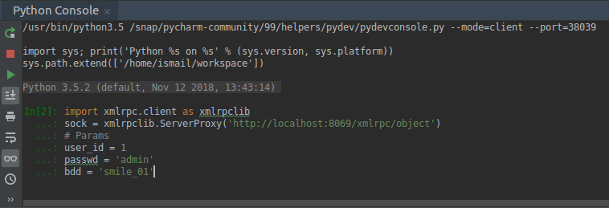

.. IMPORTANT::
   Make sure that you put your own DB, password and user_id!

2. Command to pull partner infos
---------------------------------

.. code:: python

        sock.execute(bdd, user_id, passwd, 'res.partner', 'get_partner_infos', 8)

Then the result will be :

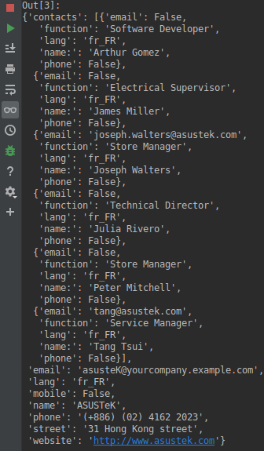

If you need just specific fields, you should add a list contains the wanted fields :

.. code:: python

        sock.execute(bdd, user_id, passwd, 'res.partner', 'get_partner_infos', 31, ['name', 'email', 'phone'])

In this case, the output will be :

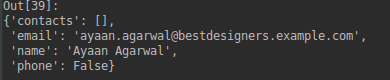

4. Command to pull sale order infos
------------------------------------

.. code:: python

        sock.execute(bdd, user_id, passwd, 'sale.order', 'get_sale_order_infos', 10, '2018-01-01', '2018-12-30')

Then the result will be :

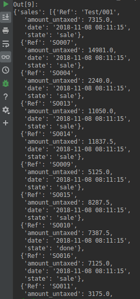

By default, we get sale orders in "done and sale" state, if you want to get sale orders with other states, you just need to add a list of states :

.. code:: python

        sock.execute(bdd, user_id, passwd, 'sale.order', 'get_sale_order_infos', 10, '2018-01-01', '2018-12-30', ['draft'])

In this case, the output will be :

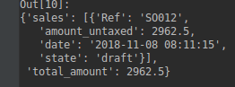

5. Command to pull purchase order infos
----------------------------------------
.. code:: python

        sock.execute(bdd, user_id, passwd, 'purchase.order', 'get_purchase_order_infos', 10, '2018-01-01', '2018-12-30')

Then the result will be :

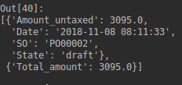

By default, we get purchase orders in 'draft and done' states, if you want to purchase orders with other states, you just need to add a list of states :

.. code:: python

        sock.execute(bdd, user_id, passwd, 'purchase.order', 'get_purchase_order_infos', 8, '2018-01-01', '2018-12-30', ['sent'])

In this case, the output will be :

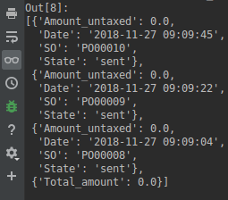

4. Command to pull account invoice orders infos
------------------------------------------------

.. code:: python

        sock.execute(bdd, user_id, passwd, 'account.invoice', 'get_account_invoice_infos', 9, '2018-01-01', '2018-12-30')

Then the result will be :

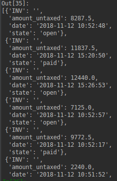

By default, we get account invoices in 'open' and 'paid' states, if you want to get account invoices with other states, you just need to add a list of states :

.. code:: python

        sock.execute(bdd, user_id, passwd, 'sale.order', 'get_sale_order_infos', 8, '2018-01-01', '2018-12-30', ['paid'])

In this case, the output will be :

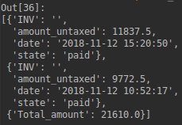

6. Command to pull stock pickings infos
----------------------------------------

.. code:: python

        sock.execute(bdd, user_id, passwd, 'stock.picking', 'get_stock_picking_infos', 8, '2018-01-01', '2018-12-30')

Then the result will be :

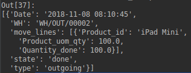

By default, we get stock pickings in 'done' state and in 'outgoing' type. If you want to get stock pickings with other states and other types, you just need to add two lists, states and other types:

.. code:: python

        sock.execute(bdd, user_id, passwd, 'stock.picking', 'get_stock_picking_infos', 8, '2018-01-01', '2018-12-30', ['assigned'], ['incoming', 'outgoing'])

In this case, the output will be :

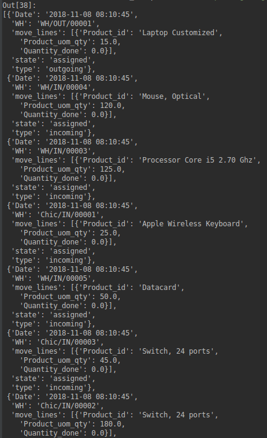

7. If we enter non-existent field's object (ex: res.partner)
--------------------------------------------------------------

.. code:: python

         sock.execute(bdd, user_id, passwd, 'res.partner', 'get_partner_infos', 15, ['jhvjkvk','name', 'email', 'phone', 'jkghg', 'kkjh'])

The output will contains "Fields_Not_exists" element:

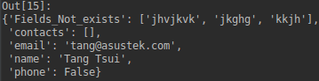

.. IMPORTANT::
   The same thing if we put non-existents states!
   Output will contains "warning_states_not_exists" element

Bug Tracker
===========

Bugs are tracked on `GitHub Issues <https://github.com/Smile-SA/odoo_addons/issues>`_.
In case of trouble, please check there if your issue has already been reported.
If you spotted it first, help us smashing it by providing a detailed and welcomed feedback
`here <https://github.com/Smile-SA/odoo_addons/issues/new?body=module:%20partner_ws%0Aversion:%2011.0%0A%0A**Steps%20to%20reproduce**%0A-%20...%0A%0A**Current%20behavior**%0A%0A**Expected%20behavior**>`_.

Do not contact contributors directly about support or help with technical issues.

Credits
=======

Authors
-------
Smile SA

Contributors
------------

Ismail EL BAKKALI

Maintainer
----------
This module is maintained by the Smile SA.

Since 1991 Smile has been a pioneer of technology and also the European expert in open source solutions.

.. image:: https://avatars0.githubusercontent.com/u/572339?s=200&v=4
   :alt: Smile SA
   :target: http://smile.fr

