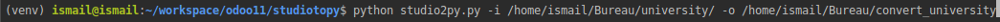

Studio2py
===================

This module's purpose is to convert Odoo Studio autogenerated XML files, into module by
respecting the general structure of the modules (models, views, security, data, static, __init__.py and __manifest__.py).

Requirements
============

Requirements can be installed by running `pip install -r requirements.txt`

Usage
=====

The command to run is `studio2py.py -i <input> -o <output>`

Where `input` is the Odoo Studio autogenerated folder (extracted) containing XML files and `output` the desired name for the module folder.

Here is an example:

Bug Tracker
===========
// To fill later

Credits
=======

Contributors
------------

* Stéphane SALAH
* Ismail EL BAKKALI

Maintainer
----------

This module is maintained by Smile SA.

Since 1991 Smile has been a pioneer of technology and also the European expert in open source solutions.
